Table: Four athletes with different MSS and MAC parameters.

|Athlete   | MSS| MAC|  TAU|
|:---------|---:|---:|----:|
|Athlete A |  12|  10| 1.20|
|Athlete B |  12|   6| 2.00|
|Athlete C |   8|  10| 0.80|
|Athlete D |   8|   6| 1.33|
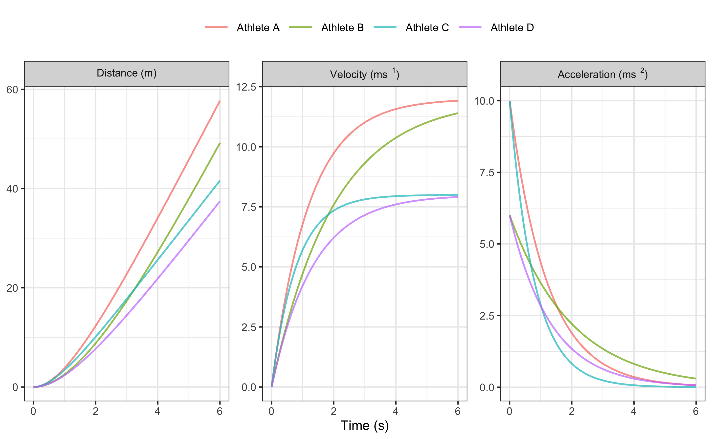
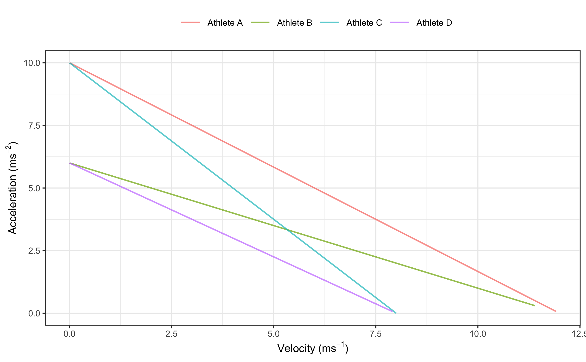

```r
require(shorts)

split_distance <- c(10, 20, 30, 40)

split_time <- c(2.17, 3.43, 4.60, 5.73)

m1 <- model_using_splits(
  distance = split_distance,
  time = split_time
)

m1
#> Estimated model parameters
#> --------------------------
#>                 MSS                 TAU                 MAC 
#>                9.01                1.31                6.89 
#>                PMAX     time_correction distance_correction 
#>               15.52                0.00                0.00 
#> 
#> Model fit estimators
#> --------------------
#>       RSE R_squared    minErr    maxErr maxAbsErr      RMSE       MAE 
#>   0.00249   1.00000  -0.00178   0.00265   0.00265   0.00176   0.00157 
#>      MAPE 
#>   0.04742
```

```r
summary(m1$model)
#> 
#> Formula: corrected_time ~ TAU * I(LambertW::W(-exp(1)^(-distance/(MSS * 
#>     TAU) - 1))) + distance/MSS + TAU
#> 
#> Parameters:
#>     Estimate Std. Error t value Pr(>|t|)    
#> MSS   9.0121     0.0155     581  3.0e-06 ***
#> TAU   1.3083     0.0066     198  2.5e-05 ***
#> ---
#> Signif. codes:  0 '***' 0.001 '**' 0.01 '*' 0.05 '.' 0.1 ' ' 1
#> 
#> Residual standard error: 0.00249 on 2 degrees of freedom
#> 
#> Number of iterations to convergence: 4 
#> Achieved convergence tolerance: 3.11e-06
```

```r
# Predict time at distance
predict_time_at_distance(
  distance = split_distance,
  MSS = m1$parameters$MSS,
  TAU = m1$parameters$TAU
)
#> [1] 2.17 3.43 4.60 5.73

# Predict acceleration at time
predict_acceleration_at_time(
  time = c(0, 1, 2, 3, 4, 5, 6),
  MSS = m1$parameters$MSS,
  TAU = m1$parameters$TAU
)
#> [1] 6.8884 3.2075 1.4935 0.6954 0.3238 0.1508 0.0702
```

```r
get_air_resistance(
  velocity = 5,
  bodymass = 80,
  bodyheight = 1.85,
  barometric_pressure = 780,
  air_temperature = 20,
  wind_velocity = 0.5
)
#> [1] 6.1
```

```r
# To calculate horizontal force produced
predict_force_at_distance(
  distance = split_distance,
  MSS = m1$parameters$MSS,
  TAU = m1$parameters$TAU,
  # Additional parameters forwarded to get_air_resistance
  # Otherwise, defaults are used
  bodymass = 80,
  bodyheight = 1.85,
  barometric_pressure = 780,
  air_temperature = 20,
  wind_velocity = 0.5
)
#> [1] 119.0  58.6  36.9  28.2

# To calculate power produced
predict_power_at_distance(
  distance = split_distance,
  MSS = m1$parameters$MSS,
  TAU = m1$parameters$TAU,
  # Additional parameters forwarded to get_air_resistance
  # Otherwise, defaults are used
  bodymass = 80,
  bodyheight = 1.85,
  barometric_pressure = 780,
  air_temperature = 20,
  wind_velocity = 0.5
)
#> [1] 868 490 323 251
```

```r
df <- predict_kinematics(
  m1,
  max_time = 6,
  frequency = 100,
  # Additional parameters forwarded to get_air_resistance
  # Otherwise, defaults are used
  bodymass = 80,
  bodyheight = 1.85,
  barometric_pressure = 780,
  air_temperature = 20,
  wind_velocity = 0.5
)

head(df)
#>   time distance velocity acceleration air_resistance force power
#> 1 0.00 0.000000   0.0000         6.89        0.07536   551   0.0
#> 2 0.01 0.000344   0.0686         6.84        0.05609   547  37.5
#> 3 0.02 0.001371   0.1367         6.78        0.03978   543  74.2
#> 4 0.03 0.003076   0.2043         6.73        0.02636   539 110.0
#> 5 0.04 0.005455   0.2714         6.68        0.01576   534 145.0
#> 6 0.05 0.008502   0.3379         6.63        0.00792   530 179.2
#>   relative_power
#> 1          0.000
#> 2          0.469
#> 3          0.928
#> 4          1.375
#> 5          1.813
#> 6          2.241
```

```r
require(tidyverse)

df <- pivot_longer(data = df, cols = -2)

ggplot(df, aes(x = distance, y = value)) +
  theme_bw(8) +
  facet_wrap(~name, scales = "free_y") +
  geom_line(alpha = 0.7) +
  ylab(NULL) +
  xlab("Distance (m)")

```

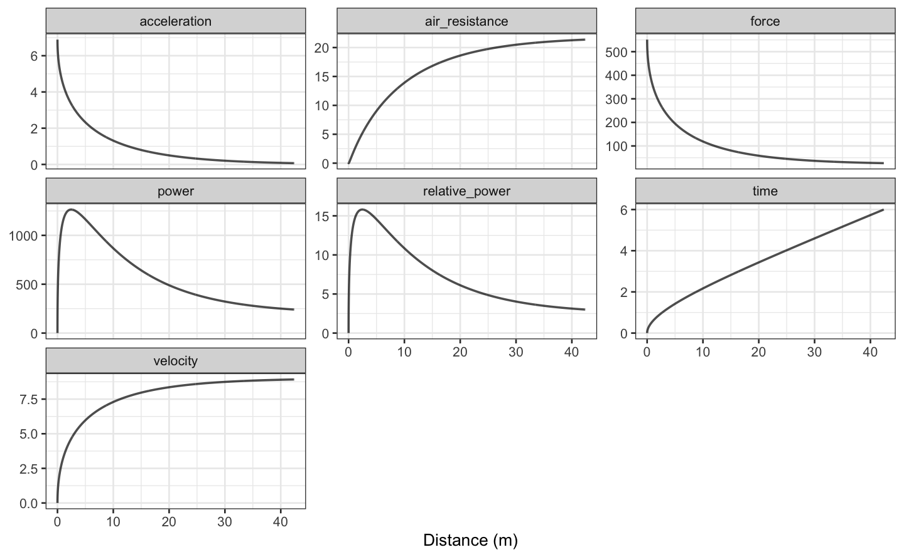

```r
# Finds distance where 90% of maximum sprinting speed is reached
find_velocity_critical_distance(
  MSS = m1$parameters$MSS,
  TAU = m1$parameters$TAU,
  percent = 0.9
)
#> [1] 16.5

# Finds maximal power and distance (this time using air resistance)
find_max_power_distance(
  MSS = m1$parameters$MSS,
  TAU = m1$parameters$TAU,
  # Additional parameters forwarded to get_air_resistance
  # Otherwise, defaults are used
  bodymass = 80,
  bodyheight = 1.85,
  barometric_pressure = 780,
  air_temperature = 20,
  wind_velocity = 0.5
)
#> $max_power
#> [1] 1264
#> 
#> $distance
#> [1] 2.46

# Finds distance over 90% power range
find_power_critical_distance(
  MSS = m1$parameters$MSS,
  TAU = m1$parameters$TAU,
  # Additional parameters forwarded to get_air_resistance
  # Otherwise, defaults are used
  bodymass = 80,
  bodyheight = 1.85,
  barometric_pressure = 780,
  air_temperature = 20,
  wind_velocity = 0.5
)
#> $lower
#> [1] 0.959
#> 
#> $upper
#> [1] 5.44
```

```r
data(split_times)

# Mixed model
m2 <- mixed_model_using_splits(
  data = split_times,
  distance = "distance",
  time = "time",
  athlete = "athlete",

  # Select random effects
  # Default is MSS and TAU
  random = MSS + TAU ~ 1
)

m2
#> Estimated fixed model parameters
#> --------------------------------
#>                 MSS                 TAU                 MAC 
#>               8.065               0.655              12.309 
#>                PMAX     time_correction distance_correction 
#>              24.818               0.000               0.000 
#> 
#> Estimated random model parameters
#> ----------------------------------
#>     athlete  MSS   TAU  MAC PMAX time_correction distance_correction
#> 1     James 9.69 0.847 11.4 27.7               0                   0
#> 2       Jim 7.83 0.505 15.5 30.4               0                   0
#> 3      John 7.78 0.727 10.7 20.8               0                   0
#> 4 Kimberley 8.57 0.802 10.7 22.9               0                   0
#> 5  Samantha 6.45 0.395 16.3 26.4               0                   0
#> 
#> Model fit estimators
#> --------------------
#>       RSE R_squared    minErr    maxErr maxAbsErr      RMSE       MAE 
#>    0.0260    0.9998   -0.0293    0.0496    0.0496    0.0214    0.0172 
#>      MAPE 
#>    0.9019
```

```r
summary(m2)
#> Nonlinear mixed-effects model fit by maximum likelihood
#>   Model: corrected_time ~ TAU * I(LambertW::W(-exp(1)^(-distance/(MSS *      TAU) - 1))) + distance/MSS + TAU 
#>  Data: train 
#>     AIC   BIC logLik
#>   -75.1 -66.7   43.5
#> 
#> Random effects:
#>  Formula: list(MSS ~ 1, TAU ~ 1)
#>  Level: athlete
#>  Structure: General positive-definite, Log-Cholesky parametrization
#>          StdDev Corr 
#> MSS      1.066  MSS  
#> TAU      0.178  0.877
#> Residual 0.026       
#> 
#> Fixed effects: MSS + TAU ~ 1 
#>     Value Std.Error DF t-value p-value
#> MSS  8.06     0.495 24   16.30       0
#> TAU  0.66     0.084 24    7.82       0
#>  Correlation: 
#>     MSS  
#> TAU 0.874
#> 
#> Standardized Within-Group Residuals:
#>    Min     Q1    Med     Q3    Max 
#> -1.909 -0.605  0.154  0.523  1.129 
#> 
#> Number of Observations: 30
#> Number of Groups: 5
```

```r
df <- predict_kinematics(m2, max_time = 10)

df <- pivot_longer(df, cols = c(-1, -3))

ggplot(
  filter(df, distance < 40),
  aes(x = distance, y = value, group = athlete, color = athlete)
) +
  theme_bw(8) +
  facet_wrap(~name, scales = "free_y") +
  geom_line(alpha = 0.7) +
  ylab(NULL) +
  xlab("Distance (m)") +
  theme(
    legend.position = "top",
    legend.title = element_blank())

```

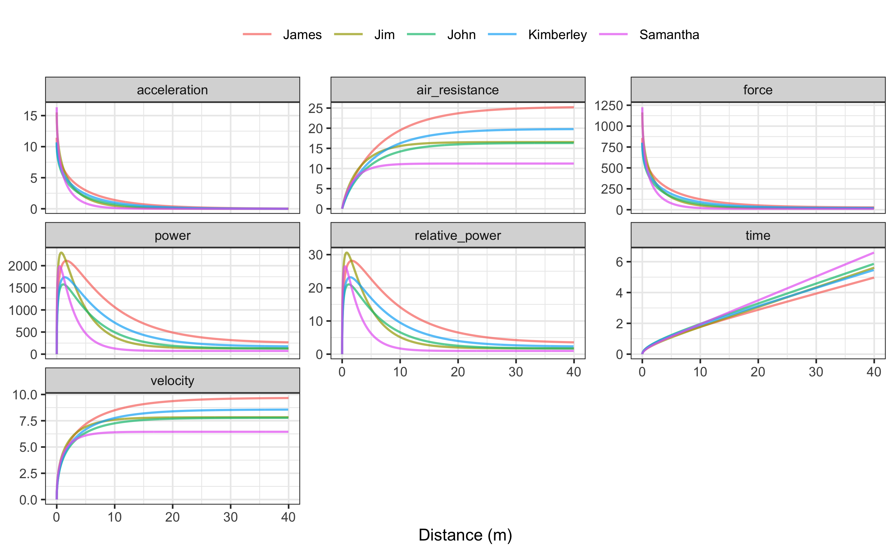

```r
sprint_time <- seq(0, 6, 1)

sprint_velocity <- c(0.00, 4.83, 7.07, 8.10, 8.59, 8.81, 8.91)

m3 <- model_using_radar(
  velocity = sprint_velocity,
  time = sprint_time
)

m3
#> Estimated model parameters
#> --------------------------
#>                 MSS                 TAU                 MAC 
#>                9.00                1.30                6.92 
#>                PMAX     time_correction distance_correction 
#>               15.58                0.00                0.00 
#> 
#> Model fit estimators
#> --------------------
#>       RSE R_squared    minErr    maxErr maxAbsErr      RMSE       MAE 
#>   0.00327   1.00000  -0.00406   0.00532   0.00532   0.00276   0.00207 
#>      MAPE 
#>       NaN
```

```r
m3_weighted <- model_using_radar(
  velocity = sprint_velocity,
  time = sprint_time,
  weights = 1 / (sprint_velocity + 1)
)

m3_weighted
#> Estimated model parameters
#> --------------------------
#>                 MSS                 TAU                 MAC 
#>                9.00                1.30                6.92 
#>                PMAX     time_correction distance_correction 
#>               15.58                0.00                0.00 
#> 
#> Model fit estimators
#> --------------------
#>       RSE R_squared    minErr    maxErr maxAbsErr      RMSE       MAE 
#>   0.00108   1.00000  -0.00406   0.00534   0.00534   0.00276   0.00206 
#>      MAPE 
#>       NaN
```

```r
data("radar_gun_data")

m4 <- mixed_model_using_radar(
  radar_gun_data,
  time = "time",
  velocity = "velocity",
  athlete = "athlete"
)

m4
#> Estimated fixed model parameters
#> --------------------------------
#>                 MSS                 TAU                 MAC 
#>                8.30                1.01                8.24 
#>                PMAX     time_correction distance_correction 
#>               17.09                0.00                0.00 
#> 
#> Estimated random model parameters
#> ----------------------------------
#>     athlete   MSS   TAU  MAC PMAX time_correction distance_correction
#> 1     James 10.00 1.111 9.00 22.5               0                   0
#> 2       Jim  8.00 0.889 9.00 18.0               0                   0
#> 3      John  8.00 1.069 7.48 15.0               0                   0
#> 4 Kimberley  9.01 1.286 7.01 15.8               0                   0
#> 5  Samantha  6.50 0.685 9.50 15.4               0                   0
#> 
#> Model fit estimators
#> --------------------
#>       RSE R_squared    minErr    maxErr maxAbsErr      RMSE       MAE 
#>    0.0516    0.9994   -0.2191    0.1983    0.2191    0.0516    0.0395 
#>      MAPE 
#>       NaN
```


```r
# Without synchronization issues
m5 <- model_using_radar(
  velocity = df$velocity,
  time = df$`true time`
)

# With time added
m6 <- model_using_radar(
  velocity = df$velocity,
  time = df$`0.5s added`
)

# With time deducted
m7 <- model_using_radar(
  velocity = df$velocity,
  time = df$`0.5s deducted`
)

rbind(
  data.frame(
    model = "True time",
    t(coef(m5))
  ),
  data.frame(
    model = "Added 0.5s time",
    t(coef(m6))
  ),
  data.frame(
    model = "Deducted 0.5s time",
    t(coef(m7))
  )
)
#>                model   MSS  TAU  MAC PMAX time_correction
#> 1          True time  9.00 1.30 6.92 15.6               0
#> 2    Added 0.5s time  9.91 2.34 4.23 10.5               0
#> 3 Deducted 0.5s time 10.08 1.86 5.43 13.7               0
#>   distance_correction
#> 1                   0
#> 2                   0
#> 3                   0
```

```r
# With time added
m8 <- model_using_radar_with_time_correction(
  velocity = df$velocity,
  time = df$`0.5s added`
)
coef(m8)
#>                 MSS                 TAU                 MAC 
#>                9.00                1.30                6.92 
#>                PMAX     time_correction distance_correction 
#>               15.58               -0.50                0.00

# With time deducted
m9 <- model_using_radar_with_time_correction(
  velocity = df$velocity,
  time = df$`0.5s deducted`
)
coef(m9)
#>                 MSS                 TAU                 MAC 
#>                9.00                1.30                6.92 
#>                PMAX     time_correction distance_correction 
#>               15.58                0.50                0.00
```

```r
# Using the true time
predict_velocity_at_time(
  time = df$`true time`,
  MSS = m5$parameters$MSS,
  TAU = m5$parameters$TAU
)
#> [1] 0.00 4.83 7.07 8.11 8.59 8.81 8.91

# Using time with sync issues
predict_velocity_at_time(
  time = df$`0.5s added`,
  MSS = m8$parameters$MSS,
  TAU = m8$parameters$TAU,
  time_correction = m8$parameters$time_correction
)
#> [1] 7.82e-05 4.83e+00 7.07e+00 8.11e+00 8.59e+00 8.81e+00 8.91e+00
```

```r
# Adding 0.5s to radar_gun_data
radar_gun_data$time <- radar_gun_data$time + 0.5

# Mixed model with time correction being fixed effect
m10 <- mixed_model_using_radar_with_time_correction(
  radar_gun_data,
  time = "time",
  velocity = "velocity",
  athlete = "athlete",
  random = MSS + TAU ~ 1
)

m10
#> Estimated fixed model parameters
#> --------------------------------
#>                 MSS                 TAU                 MAC 
#>                8.30                1.01                8.24 
#>                PMAX     time_correction distance_correction 
#>               17.10               -0.50                0.00 
#> 
#> Estimated random model parameters
#> ----------------------------------
#>     athlete   MSS   TAU  MAC PMAX time_correction distance_correction
#> 1     James 10.00 1.111 9.00 22.5            -0.5                   0
#> 2       Jim  8.00 0.889 9.00 18.0            -0.5                   0
#> 3      John  8.00 1.069 7.48 15.0            -0.5                   0
#> 4 Kimberley  9.01 1.285 7.01 15.8            -0.5                   0
#> 5  Samantha  6.50 0.685 9.50 15.4            -0.5                   0
#> 
#> Model fit estimators
#> --------------------
#>       RSE R_squared    minErr    maxErr maxAbsErr      RMSE       MAE 
#>    0.0516    0.9994   -0.2190    0.1983    0.2190    0.0516    0.0395 
#>      MAPE 
#>       Inf

# Mixed model with time correction being random effect
m11 <- mixed_model_using_radar_with_time_correction(
  radar_gun_data,
  time = "time",
  velocity = "velocity",
  athlete = "athlete",
  random = MSS + TAU + time_correction ~ 1
)

m11
#> Estimated fixed model parameters
#> --------------------------------
#>                 MSS                 TAU                 MAC 
#>                8.30                1.01                8.24 
#>                PMAX     time_correction distance_correction 
#>               17.10               -0.50                0.00 
#> 
#> Estimated random model parameters
#> ----------------------------------
#>     athlete   MSS   TAU  MAC PMAX time_correction distance_correction
#> 1     James 10.00 1.110 9.00 22.5            -0.5                   0
#> 2       Jim  8.00 0.889 9.00 18.0            -0.5                   0
#> 3      John  8.00 1.069 7.48 15.0            -0.5                   0
#> 4 Kimberley  9.01 1.285 7.01 15.8            -0.5                   0
#> 5  Samantha  6.50 0.685 9.50 15.4            -0.5                   0
#> 
#> Model fit estimators
#> --------------------
#>       RSE R_squared    minErr    maxErr maxAbsErr      RMSE       MAE 
#>    0.0516    0.9994   -0.2188    0.1982    0.2188    0.0516    0.0395 
#>      MAPE 
#>       Inf
```

```r
MSS <- 9
TAU <- 1.3
MAC <- MSS / TAU

split_times <- tibble(
  distance = c(5, 10, 20, 30, 40),
  john_time = predict_time_at_distance(distance, MSS, TAU),

  # Jack's performance
  jack_distance = distance + 0.5,
  jack_true_time = predict_time_at_distance(jack_distance, MSS, TAU),
  time_05m = predict_time_at_distance(0.5, MSS, TAU),
  jack_time = jack_true_time - time_05m
)

split_times
#> # A tibble: 5 x 6
#>   distance john_time jack_distance jack_true_time time_05m jack_time
#>      <dbl>  <I<dbl>>         <dbl>       <I<dbl>> <I<dbl>>  <I<dbl>>
#> 1        5      1.42           5.5           1.50    0.400      1.10
#> 2       10      2.17          10.5           2.23    0.400      1.83
#> 3       20      3.43          20.5           3.49    0.400      3.09
#> 4       30      4.60          30.5           4.65    0.400      4.25
#> 5       40      5.73          40.5           5.78    0.400      5.39
```

```r
plot_df <- split_times %>%
  select(distance, john_time, jack_time) %>%
  rename(John = john_time, Jack = jack_time) %>%
  pivot_longer(cols = -1, names_to = "athlete", values_to = "time") %>%
  mutate(distance = factor(distance))

ggplot(
  plot_df,
  aes(x = distance, y = time, color = athlete, group = athlete)
) +
  theme_bw(8) +
  geom_point() +
  geom_line() +
  xlab("Distance (m)") +
  ylab("Time (s)") +
  theme(
    legend.title = element_blank(),
    legend.position = "top")

```

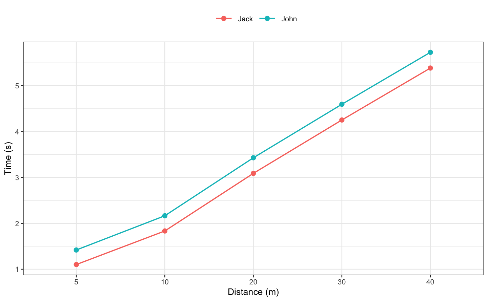

```r
# Since this is a perfect simulation and stats::nls will complain
# we need to add very small noise, or measurement error to the times
set.seed(1667)
rand_noise <- rnorm(nrow(split_times), 0, 10^-5)
split_times$john_time <- split_times$john_time + rand_noise
split_times$jack_time <- split_times$jack_time + rand_noise

john_profile <- model_using_splits(
  distance = split_times$distance,
  time = split_times$john_time
)

jack_profile <- model_using_splits(
  distance = split_times$distance,
  time = split_times$jack_time
)

sprint_parameters <- rbind(
  unlist(john_profile$parameters),
  unlist(jack_profile$parameters)
)

rownames(sprint_parameters) <- c("John", "Jack")

sprint_parameters
#>       MSS   TAU   MAC PMAX time_correction distance_correction
#> John 9.00 1.300  6.92 15.6               0                   0
#> Jack 8.49 0.704 12.06 25.6               0                   0
```

```r
sim_df <- expand.grid(
  MSS = c(6, 7, 8, 9),
  MAC = c(6, 7, 8, 9),
  flying_start_distance = c(
    seq(0, 0.001, length.out = 20),
    seq(0.001, 0.01, length.out = 20),
    seq(0.01, 0.1, length.out = 20),
    seq(0.1, 1, length.out = 20)
  ),
  distance = c(5, 10, 20, 30, 40, 50)
)

sim_df <- sim_df %>%
  mutate(
    TAU = MSS / MAC,
    PMAX = MSS * MAC / 4,
    true_distance = distance + flying_start_distance,
    true_time = predict_time_at_distance(true_distance, MSS, TAU),
    stolen_time = predict_time_at_distance(flying_start_distance, MSS, TAU),
    time = true_time - stolen_time
  )

# Add small noise to allow model fit
set.seed(1667)
rand_noise <- rnorm(nrow(sim_df), 0, 10^-4)
sim_df$time <- sim_df$time + rand_noise

```

```r
# Prediction wrapper
pred_wrapper <- function(data) {
  model <- model_using_splits(
    distance = data$distance,
    time = data$time
  )

  params <- data.frame(t(unlist(model$parameters)))

  predicted_time <- predict_time_at_distance(
    distance = data$distance,
    MSS = model$parameters$MSS,
    TAU = model$parameters$TAU
  )

  colnames(params) <- c(
    "est_MSS", "est_TAU", "est_MAC", "est_PMAX",
    "est_time_correction", "est_distance_correction"
  )

  cbind(
    data,
    params,
    data.frame(predicted_time = as.numeric(predicted_time))
  )
}

# estimated parameters and predicted time
model_df <- sim_df %>%
  group_by(MSS, TAU, flying_start_distance) %>%
  do(pred_wrapper(.)) %>%
  ungroup()

# Prediction residuals
model_df$residuals <- model_df$predicted_time - model_df$time

```

```r
# Estimates plot
df <- model_df %>%
  group_by(MSS, TAU, flying_start_distance) %>%
  slice(1) %>%
  mutate(
    MSS_string = paste("MSS =", MSS),
    TAU_string = paste("TAU =", TAU),
    MAC_string = paste("MAC = ", round(MAC, 2)),
    PMAX_string = paste("PMAX = ", round(PMAX, 2))
  )

# MSS
ggplot(
  df,
  aes(x = flying_start_distance, y = est_MSS, color = MAC_string)
) +
  theme_bw(8) +
  geom_line(alpha = 0.7) +
  facet_wrap(~MSS_string, scales = "free_y") +
  xlab("Flying start distance (m)") +
  ylab("estimated MSS (m/s)") +
  theme(
    legend.title = element_blank(),
    legend.position = "top")

```

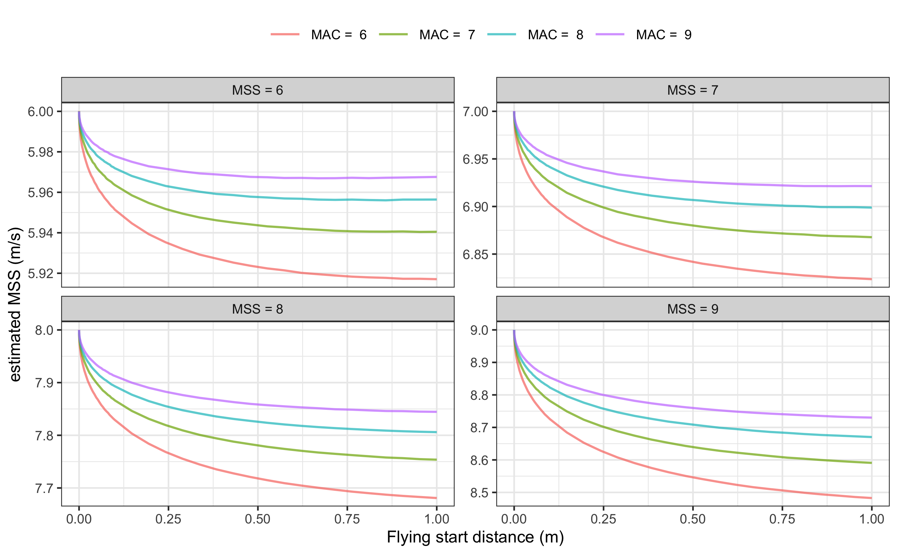

```r
# MAC
ggplot(
  df,
  aes(x = flying_start_distance, y = est_MAC, color = MSS_string)
) +
  theme_bw(8) +
  geom_line(alpha = 0.7) +
  facet_wrap(~MAC_string, scales = "free_y") +
  xlab("Flying start distance (m)") +
  ylab("estimated MAC (m/s/s)") +
  theme(
    legend.title = element_blank(),
    legend.position = "top")

```

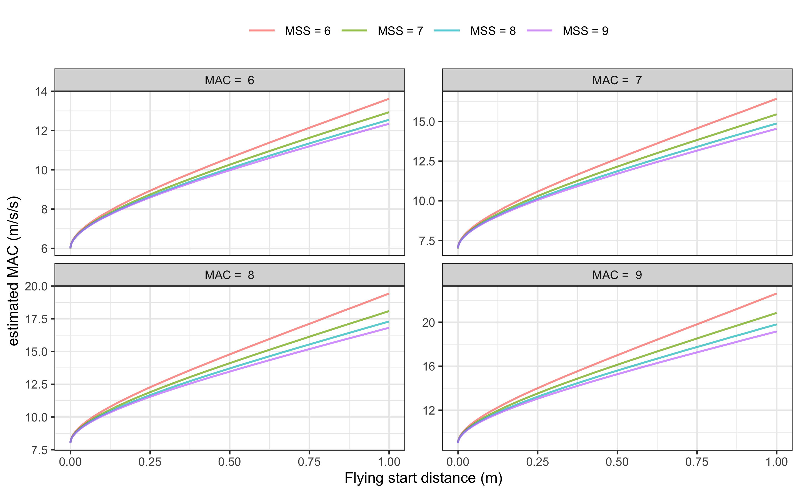

```r
# PMAX
ggplot(
  df,
  aes(x = flying_start_distance, y = est_PMAX, color = MSS_string)
) +
  theme_bw(8) +
  geom_line(alpha = 0.7) +
  facet_wrap(~MAC_string, scales = "free_y") +
  xlab("Flying start distance (m)") +
  ylab("estimated PMAX (W/kg)") +
  theme(
    legend.title = element_blank(),
    legend.position = "top")

```

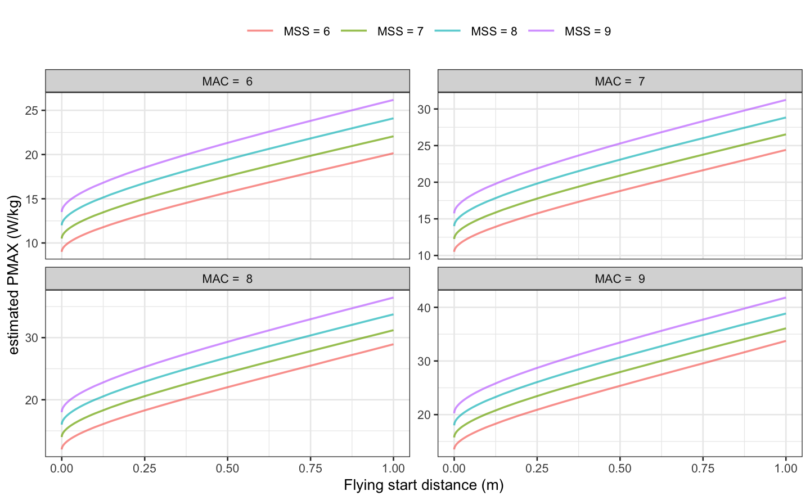

```r
# Residuals
model_df <- model_df %>%
  mutate(
    MSS_string = paste("MSS =", MSS),
    TAU_string = paste("TAU =", TAU),
    MAC_string = paste("MAC = ", round(MAC, 2)),
    PMAX_string = paste("PMAX = ", round(PMAX, 2)),
    group = paste(MSS, MAC, flying_start_distance)
  )

ggplot(
  model_df,
  aes(y = residuals, x = distance, color = flying_start_distance, group = group)
) +
  theme_bw(8) +
  geom_line(alpha = 0.3) +
  facet_grid(MSS_string ~ MAC_string) +
  geom_hline(yintercept = 0, linetype = "dashed") +
  scale_color_gradientn(colours = terrain.colors(5, rev = FALSE)) +
  xlab("Distance (m)") +
  ylab("Predicted time - observed time (s)") +
  theme(legend.position = "top") +
  labs(color = "Flying start distance")

```

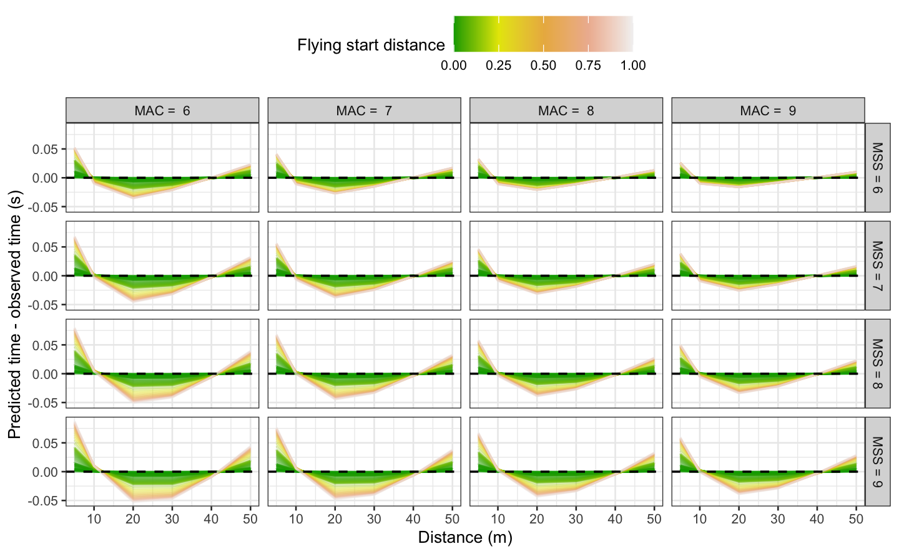

```r
ggplot(
  model_df,
  aes(y = residuals, x = distance, color = flying_start_distance, group = group)
) +
  theme_bw(8) +
  geom_line(alpha = 0.3) +
  geom_hline(yintercept = 0, linetype = "dashed") +
  scale_color_gradientn(colours = terrain.colors(5, rev = FALSE)) +
  xlab("Distance (m)") +
  ylab("Predicted time - observed time (s)") +
  theme(legend.position = "top") +
  labs(color = "Flying start distance")

```

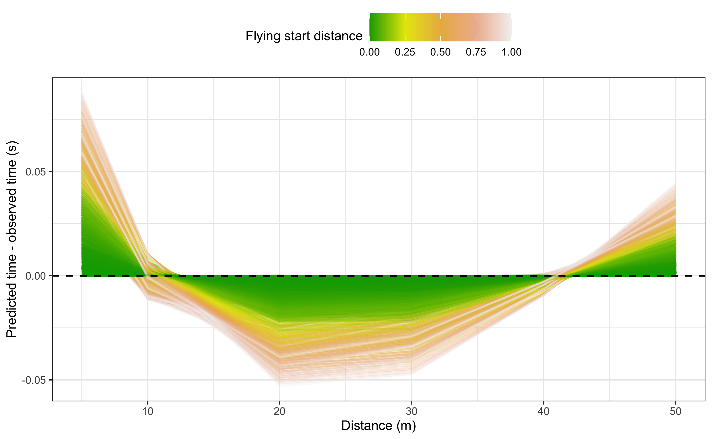

```r
jack_profile_fixed_time_short <- model_using_splits(
  distance = split_times$distance,
  time = split_times$jack_time,
  time_correction = 0.3
)

jack_profile_fixed_time_long <- model_using_splits(
  distance = split_times$distance,
  time = split_times$jack_time,
  time_correction = 0.5
)

jack_profile_time_estimated <- model_using_splits_with_time_correction(
  distance = split_times$distance,
  time = split_times$jack_time
)

jack_parameters <- rbind(
  unlist(john_profile$parameters),
  unlist(jack_profile$parameters),
  unlist(jack_profile_fixed_time_short$parameters),
  unlist(jack_profile_fixed_time_long$parameters),
  unlist(jack_profile_time_estimated$parameters)
)

rownames(jack_parameters) <- c(
  "John",
  "Jack - No corrections",
  "Jack - Fixed time correction (+0.3s)",
  "Jack - Fixed time correction (+0.5s)",
  "Jack - Estimated time correction"
)

jack_parameters
#>                                       MSS   TAU   MAC PMAX
#> John                                 9.00 1.300  6.92 15.6
#> Jack - No corrections                8.49 0.704 12.06 25.6
#> Jack - Fixed time correction (+0.3s) 9.00 1.251  7.19 16.2
#> Jack - Fixed time correction (+0.5s) 9.62 1.770  5.43 13.1
#> Jack - Estimated time correction     8.96 1.216  7.37 16.5
#>                                      time_correction
#> John                                           0.000
#> Jack - No corrections                          0.000
#> Jack - Fixed time correction (+0.3s)           0.300
#> Jack - Fixed time correction (+0.5s)           0.500
#> Jack - Estimated time correction               0.284
#>                                      distance_correction
#> John                                                   0
#> Jack - No corrections                                  0
#> Jack - Fixed time correction (+0.3s)                   0
#> Jack - Fixed time correction (+0.5s)                   0
#> Jack - Estimated time correction                       0
```

```r
jack_profile_distance_correction <- model_using_splits_with_corrections(
  distance = split_times$distance,
  time = split_times$jack_time
)

jack_parameters <- rbind(
  unlist(john_profile$parameters),
  unlist(jack_profile$parameters),
  unlist(jack_profile_fixed_time_short$parameters),
  unlist(jack_profile_fixed_time_long$parameters),
  unlist(jack_profile_time_estimated$parameters),
  unlist(jack_profile_distance_correction$parameters)
)

rownames(jack_parameters) <- c(
  "John",
  "Jack - No corrections",
  "Jack - Fixed time correction (+0.3s)",
  "Jack - Fixed time correction (+0.5s)",
  "Jack - Estimated time correction",
  "Jack - Estimated distance correction"
)

jack_parameters
#>                                       MSS   TAU   MAC PMAX
#> John                                 9.00 1.300  6.92 15.6
#> Jack - No corrections                8.49 0.704 12.06 25.6
#> Jack - Fixed time correction (+0.3s) 9.00 1.251  7.19 16.2
#> Jack - Fixed time correction (+0.5s) 9.62 1.770  5.43 13.1
#> Jack - Estimated time correction     8.96 1.216  7.37 16.5
#> Jack - Estimated distance correction 9.00 1.301  6.92 15.6
#>                                      time_correction
#> John                                           0.000
#> Jack - No corrections                          0.000
#> Jack - Fixed time correction (+0.3s)           0.300
#> Jack - Fixed time correction (+0.5s)           0.500
#> Jack - Estimated time correction               0.284
#> Jack - Estimated distance correction           0.400
#>                                      distance_correction
#> John                                               0.000
#> Jack - No corrections                              0.000
#> Jack - Fixed time correction (+0.3s)               0.000
#> Jack - Fixed time correction (+0.5s)               0.000
#> Jack - Estimated time correction                   0.000
#> Jack - Estimated distance correction               0.503
```

```r
pred_wrapper <- function(data) {
  no_correction <- model_using_splits(
    distance = data$distance,
    time = data$time
  )

  fixed_correction_short <- model_using_splits(
    distance = data$distance,
    time = data$time,
    time_correction = 0.3
  )

  fixed_correction_long <- model_using_splits(
    distance = data$distance,
    time = data$time,
    time_correction = 0.5
  )

  time_correction <- model_using_splits_with_time_correction(
    distance = data$distance,
    time = data$time,
    control = nls.control(tol = 1)
  )

  time_dist_correction <- model_using_splits_with_corrections(
    distance = data$distance,
    time = data$time,
    control = nls.control(tol = 1)
  )


  params <- rbind(
    data.frame(
      model = "No correction",
      t(unlist(no_correction$parameters))
    ),
    data.frame(
      model = "Fixed correction +0.3s",
      t(unlist(fixed_correction_short$parameters))
    ),
    data.frame(
      model = "Fixed correction +0.5s",
      t(unlist(fixed_correction_long$parameters))
    ),
    data.frame(
      model = "Time correction",
      t(unlist(time_correction$parameters))
    ),
    data.frame(
      model = "Time and distance correction",
      t(unlist(time_dist_correction$parameters))
    )
  )

  colnames(params) <- c(
    "model", "est_MSS", "est_TAU", "est_MAC", "est_PMAX",
    "est_time_correction", "est_distance_correction"
  )

  df <- expand_grid(
    data,
    params
  )

  df$predicted_time <- predict_time_at_distance(
    distance = df$distance,
    MSS = df$est_MSS,
    TAU = df$est_TAU,
    time_correction = df$est_time_correction,
    distance_correction = df$est_distance_correction
  )

  df$residuals <- df$predicted_time - df$time
  return(df)
}

# estimated parameters and predicted time
model_df <- sim_df %>%
  group_by(MSS, TAU, flying_start_distance) %>%
  do(pred_wrapper(.)) %>%
  ungroup()

```

```r
model_df$model <- factor(
  model_df$model,
  levels = c(
    "No correction",
    "Fixed correction +0.3s",
    "Fixed correction +0.5s",
    "Time correction",
    "Time and distance correction"
  )
)
# Estimates plot
df <- model_df %>%
  group_by(MSS, TAU, flying_start_distance, model) %>%
  slice(1) %>%
  mutate(
    MSS_string = paste("MSS =", MSS),
    TAU_string = paste("TAU =", TAU),
    MAC_string = paste("MAC = ", round(MAC, 2)),
    PMAX_string = paste("PMAX = ", round(PMAX, 2))
  )

# MSS
ggplot(
  df,
  aes(x = flying_start_distance, y = est_MSS, color = model)
) +
  theme_bw(8) +
  geom_line(alpha = 0.7) +
  facet_grid(MSS_string ~ MAC_string, scales = "free_y") +
  xlab("Flying start distance (m)") +
  ylab("estimated MSS (m/s)") +
  theme(
    legend.title = element_blank(),
    legend.position = "top")

```

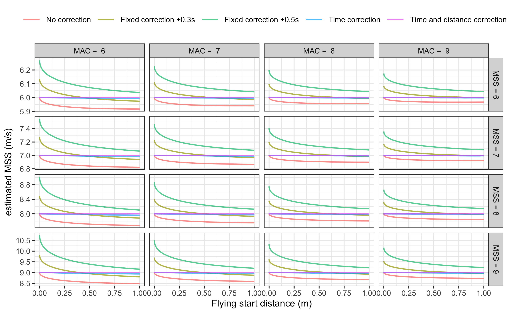

```r
# MAC
ggplot(
  df,
  aes(x = flying_start_distance, y = est_MAC, color = model)
) +
  theme_bw(8) +
  geom_line(alpha = 0.7) +
  facet_grid(MAC_string ~ MSS_string, scales = "free_y") +
  xlab("Flying start distance (m)") +
  ylab("estimated MAC (m/s/s)") +
  theme(
    legend.title = element_blank(),
    legend.position = "top")

```

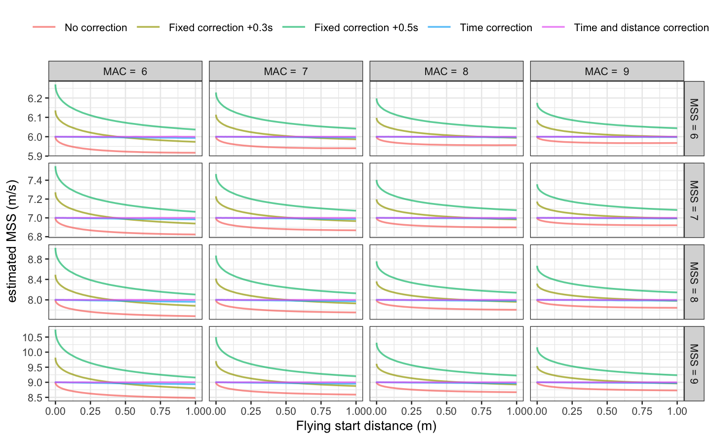

```r
# PMAX
ggplot(
  df,
  aes(x = flying_start_distance, y = est_PMAX, color = model)
) +
  theme_bw(8) +
  geom_line(alpha = 0.7) +
  facet_grid(MAC_string ~ MSS_string, scales = "free_y") +
  xlab("Flying start distance (m)") +
  ylab("estimated PMAX (W/kg)") +
  theme(
    legend.title = element_blank(),
    legend.position = "top")

```


```r
# time_correction
ggplot(
  df,
  aes(x = flying_start_distance, y = est_time_correction, color = model)
) +
  theme_bw(8) +
  geom_line(alpha = 0.7) +
  geom_line(aes(y = stolen_time), color = "black", linetype = "dashed") +
  facet_grid(MAC_string ~ MSS_string, scales = "free_y") +
  xlab("Flying start distance (m)") +
  ylab("estimated time correction (s)")  +
  theme(
    legend.title = element_blank(),
    legend.position = "top")

```

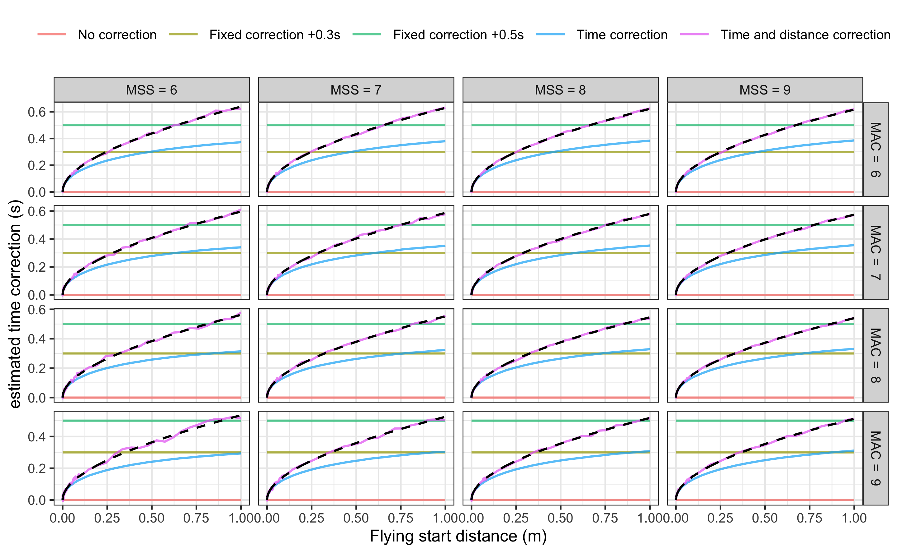

```r
# distance_correction
ggplot(
  df,
  aes(x = flying_start_distance, y = est_distance_correction, color = model)
) +
  theme_bw(8) +
  geom_line(alpha = 0.7) +
  geom_abline(slope = 1, color = "black", linetype = "dashed") +
  facet_grid(MAC_string ~ MSS_string, scales = "free_y") +
  xlab("Flying start distance (m)") +
  ylab("estimated distance correction (m)") +
  theme(
    legend.title = element_blank(),
    legend.position = "top")

```

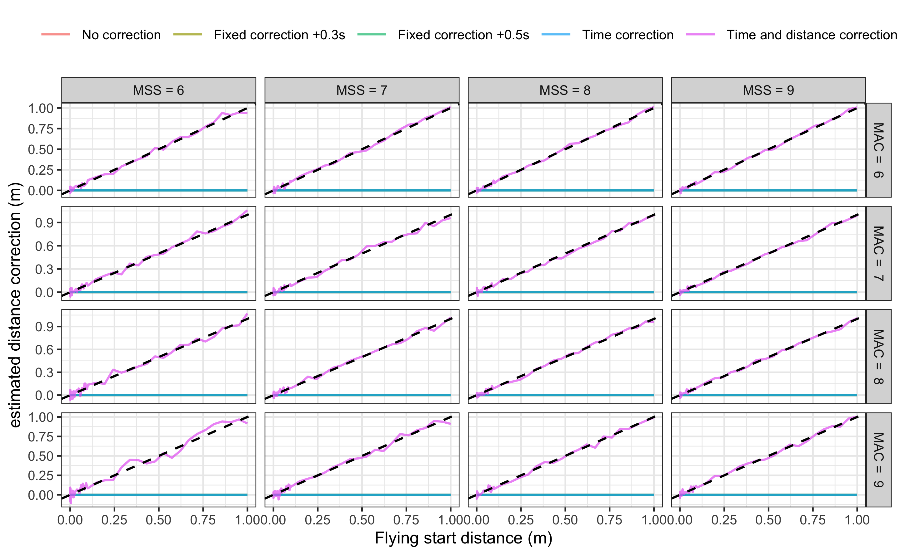

```r
# Residuals
model_df <- model_df %>%
  mutate(
    MSS_string = paste("MSS =", MSS),
    TAU_string = paste("TAU =", TAU),
    MAC_string = paste("MAC = ", round(MAC, 2)),
    PMAX_string = paste("PMAX = ", round(PMAX, 2)),
    group = paste(MSS, MAC, flying_start_distance)
  )

ggplot(
  model_df,
  aes(y = residuals, x = distance, color = flying_start_distance, group = group)
) +
  theme_bw(8) +
  geom_line(alpha = 0.3) +
  facet_wrap(~model) +
  geom_hline(yintercept = 0, linetype = "dashed") +
  scale_color_gradientn(colours = terrain.colors(5, rev = FALSE)) +
  xlab("Distance (m)") +
  ylab("Predicted time - observed time (s)") +
  theme(legend.position = "top") +
  labs(color = "Flying start distance")

```

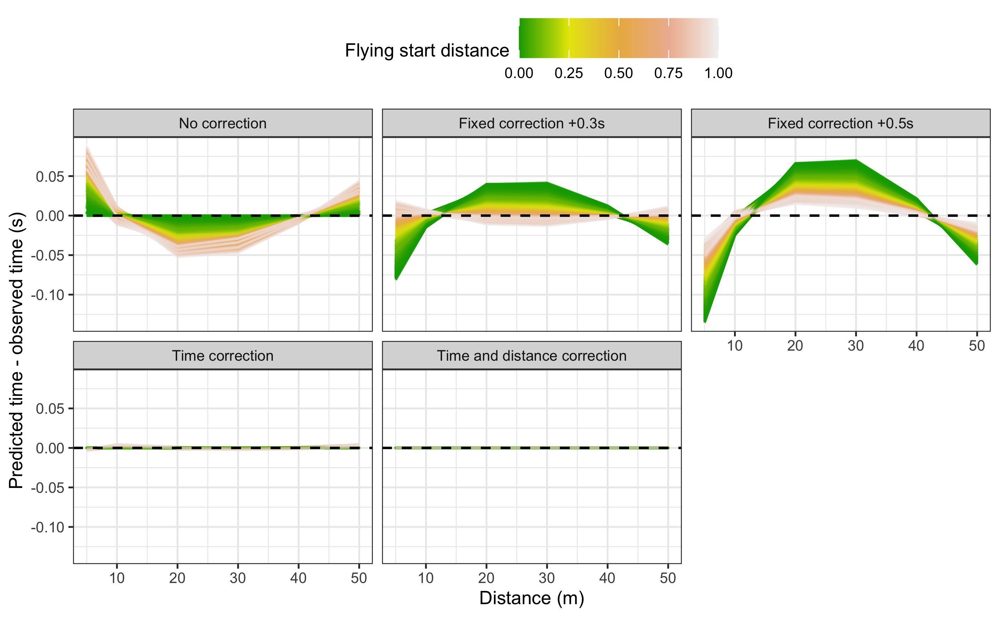

```r
sim_df <- expand.grid(
  MSS = c(6, 7, 8, 9),
  MAC = c(6, 7, 8, 9),
  time_lag = seq(0, 0.5, length.out = 50),
  distance = c(5, 10, 20, 30, 40, 50)
)

sim_df <- sim_df %>%
  mutate(
    TAU = MSS / MAC,
    PMAX = MSS * MAC / 4,
    true_time = predict_time_at_distance(distance, MSS, TAU),
    time = true_time + time_lag
  )

# Add small noise to allow model fit
set.seed(1667)
rand_noise <- rnorm(nrow(sim_df), 0, 10^-4)
sim_df$time <- sim_df$time + rand_noise

```

```r
# estimated parameters and predicted time
model_df <- sim_df %>%
  group_by(MSS, TAU, time_lag) %>%
  do(pred_wrapper(.)) %>%
  ungroup()

```

```r
model_df$model <- factor(
  model_df$model,
  levels = c(
    "No correction",
    "Fixed correction +0.3s",
    "Fixed correction +0.5s",
    "Time correction",
    "Time and distance correction"
  )
)
# Estimates plot
df <- model_df %>%
  group_by(MSS, TAU, time_lag, model) %>%
  slice(1) %>%
  mutate(
    MSS_string = paste("MSS =", MSS),
    TAU_string = paste("TAU =", TAU),
    MAC_string = paste("MAC = ", round(MAC, 2)),
    PMAX_string = paste("PMAX = ", round(PMAX, 2))
  )

# MSS
ggplot(df, aes(x = time_lag, y = est_MSS, color = model)) +
  theme_bw(8) +
  geom_line(alpha = 0.7) +
  facet_grid(MSS_string ~ MAC_string, scales = "free_y") +
  xlab("Time lag (s)") +
  ylab("estimated MSS (m/s)") +
  theme(
    legend.title = element_blank(),
    legend.position = "top")

```

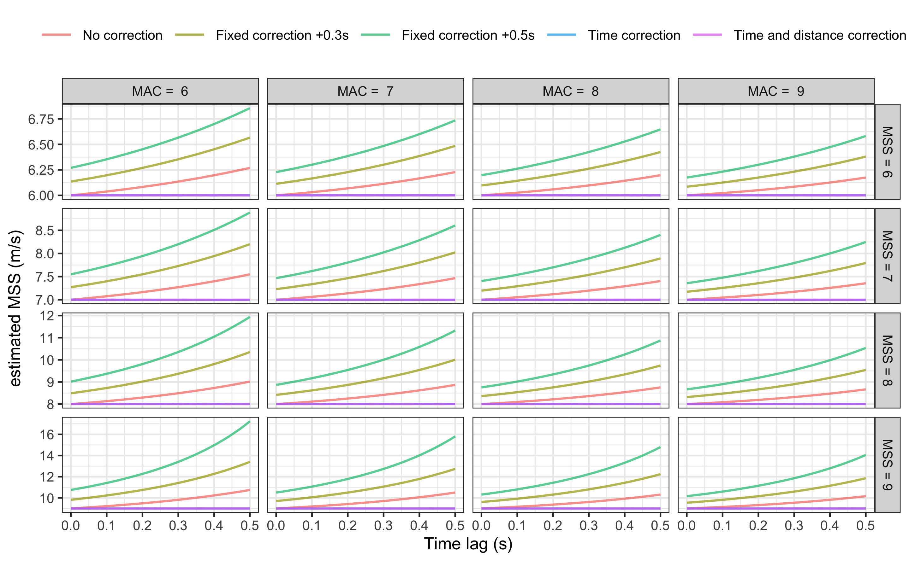

```r
# MAC
ggplot(df, aes(x = time_lag, y = est_MAC, color = model)) +
  theme_bw(8) +
  geom_line(alpha = 0.7) +
  facet_grid(MAC_string ~ MSS_string, scales = "free_y") +
  xlab("Time lag (s)") +
  ylab("estimated MAC (m/s/s)") +
  theme(
    legend.title = element_blank(),
    legend.position = "top")

```

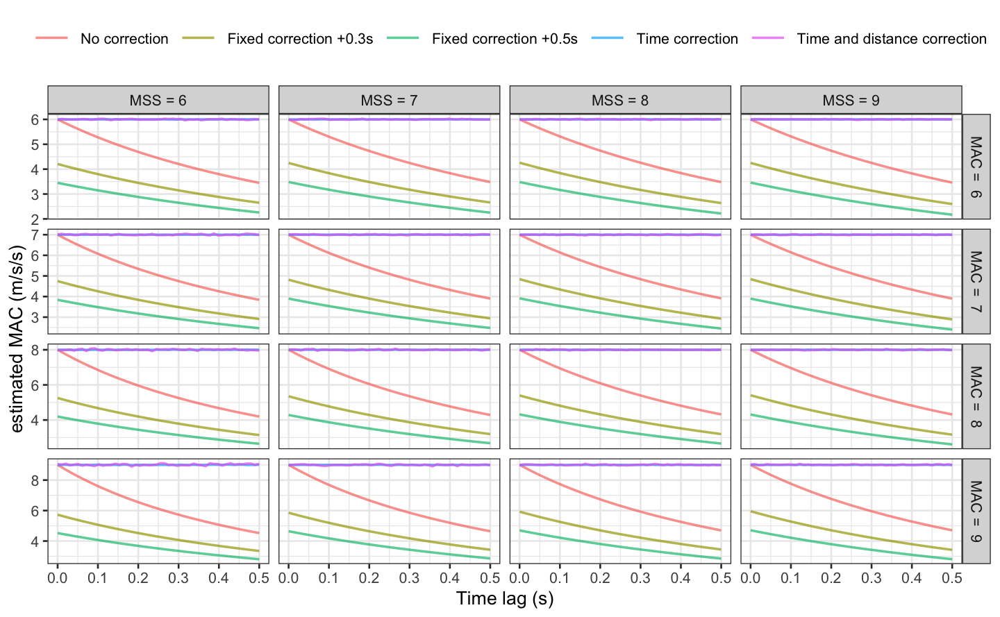

```r
# time_correction
ggplot(
  df,
  aes(x = time_lag, y = est_time_correction, color = model)
) +
  theme_bw(8) +
  geom_line(alpha = 0.7) +
  geom_abline(slope = -1, color = "black", linetype = "dashed") +
  facet_grid(MAC_string ~ MSS_string, scales = "free_y") +
  xlab("Time lag (s)") +
  ylab("estimated time correction (s)") +
  theme(
    legend.title = element_blank(),
    legend.position = "top")

```

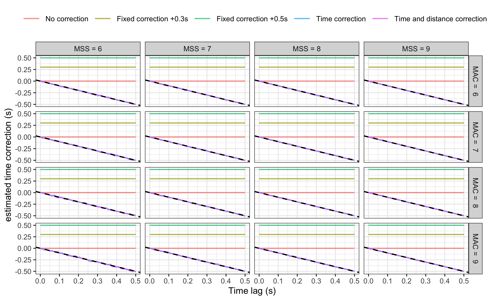

```r
# distance_correction
ggplot(
  df,
  aes(x = time_lag, y = est_distance_correction, color = model)
) +
  theme_bw(8) +
  geom_line(alpha = 0.7) +
  facet_grid(MAC_string ~ MSS_string, scales = "free_y") +
  xlab("Time lag (s)") +
  ylab("estimated distance correction (m)") +
  theme(
    legend.title = element_blank(),
    legend.position = "top")

```

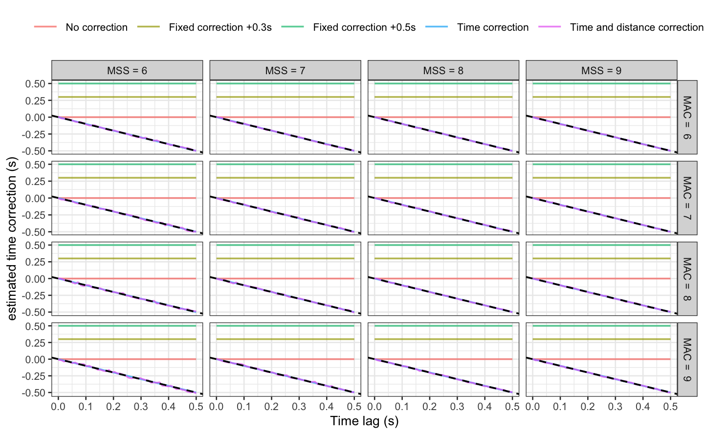

```r
# Residuals
model_df <- model_df %>%
  mutate(
    MSS_string = paste("MSS =", MSS),
    TAU_string = paste("TAU =", TAU),
    MAC_string = paste("MAC = ", round(MAC, 2)),
    PMAX_string = paste("PMAX = ", round(PMAX, 2)),
    group = paste(MSS, MAC, time_lag)
  )

ggplot(
  model_df,
  aes(y = residuals, x = distance, color = time_lag, group = group)
) +
  theme_bw(8) +
  geom_line(alpha = 0.3) +
  facet_wrap(~model) +
  geom_hline(yintercept = 0, linetype = "dashed") +
  scale_color_gradientn(colours = terrain.colors(5, rev = FALSE)) +
  xlab("Distance (m)") +
  ylab("Predicted time - observed time (s)")  +
  theme(legend.position = "top") +
  labs(color = "Time lag")

```

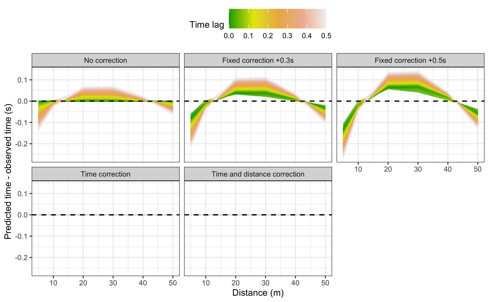

```r
jack_LOOCV <- model_using_splits_with_time_correction(
  distance = split_times$distance,
  time = split_times$jack_time,
  LOOCV = TRUE
)

jack_LOOCV
#> Estimated model parameters
#> --------------------------
#>                 MSS                 TAU                 MAC 
#>               8.958               1.216               7.367 
#>                PMAX     time_correction distance_correction 
#>              16.499               0.284               0.000 
#> 
#> Model fit estimators
#> --------------------
#>       RSE R_squared    minErr    maxErr maxAbsErr      RMSE       MAE 
#>   0.00181   1.00000  -0.00109   0.00189   0.00189   0.00114   0.00104 
#>      MAPE 
#>   0.04981 
#> 
#> 
#> Leave-One-Out Cross-Validation
#> ------------------------------
#> Parameters:
#>    MSS  TAU  MAC PMAX time_correction distance_correction
#> 1 8.98 1.25 7.21 16.2           0.300                   0
#> 2 8.97 1.22 7.35 16.5           0.284                   0
#> 3 8.95 1.21 7.40 16.5           0.282                   0
#> 4 8.96 1.21 7.39 16.5           0.282                   0
#> 5 8.93 1.20 7.45 16.6           0.278                   0
#> 
#> Model fit:
#>       RSE R_squared    minErr    maxErr maxAbsErr      RMSE       MAE 
#>        NA   1.00000  -0.00639   0.00510   0.00639   0.00401   0.00349 
#>      MAPE 
#>   0.18387
```

```r
df <- jack_LOOCV$LOOCV$parameters

df <- pivot_longer(df, cols = 1:6, names_to = "parameter")

df$parameter <- factor(
  df$parameter,
  levels = c(
    "MSS",
    "TAU",
    "MAC",
    "PMAX",
    "time_correction",
    "distance_correction"
  )
)

ggplot(df, aes(x = value)) +
  theme_bw(8) +
  geom_boxplot() +
  facet_wrap(~parameter, scales = "free_x") +
  xlab(NULL) +
  ylab(NULL) +
  theme(
    axis.ticks.y = element_blank(),
    axis.text.y = element_blank()
  )

```

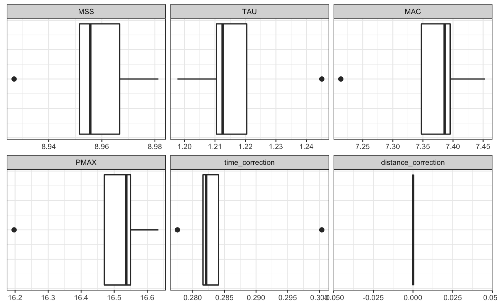

```r
df <- data.frame(
  distance = jack_LOOCV$data$distance,
  time = jack_LOOCV$data$time,
  pred_time = jack_LOOCV$data$pred_time,
  LOOCV_time = jack_LOOCV$LOOCV$data$pred_time
)

df <- df %>%
  pivot_longer(cols = c("pred_time", "LOOCV_time"))

df$resid <- df$value - df$time

ggplot(df, aes(x = distance, y = resid, color = name)) +
  theme_bw(8) +
  geom_hline(yintercept = 0, linetype = "dashed") +
  geom_point() +
  theme(legend.title = element_blank()) +
  xlab("Distance (m)") +
  ylab("Predicted - observed time (s)") +
  theme(
    legend.title = element_blank(),
    legend.position = "top")

```

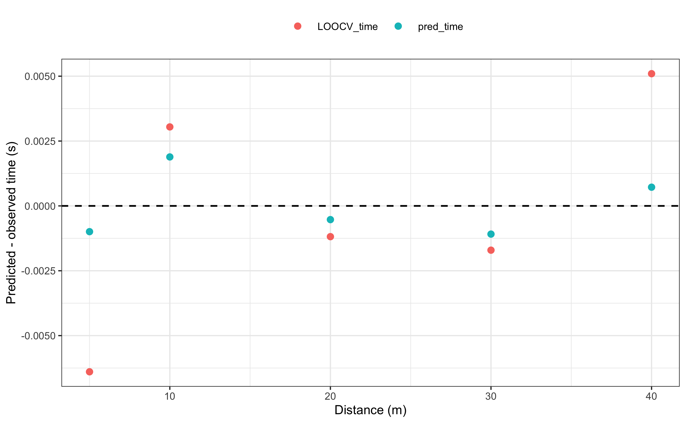

```r
bolt_reaction_time <- 0.183

bolt_distance <- c(10, 20, 30, 40, 50, 60)
bolt_time <- c(1.963, 2.983, 3.883, 4.763, 5.643, 6.493)

# No corrections model
bolt_m1 <- model_using_splits(
  distance = bolt_distance,
  time = bolt_time
)

# Model with reaction time as fixed time correction
bolt_m2 <- model_using_splits(
  distance = bolt_distance,
  time = bolt_time,
  time_correction = -bolt_reaction_time
)

# Model with estimated time correction
bolt_m3 <- model_using_splits_with_time_correction(
  distance = bolt_distance,
  time = bolt_time
)

# Model with estimated time correction, but deducted reaction time
bolt_m4 <- model_using_splits_with_time_correction(
  distance = bolt_distance,
  time = bolt_time - bolt_reaction_time
)

# Model with estimated time and distance corrections
bolt_m5 <- model_using_splits_with_corrections(
  distance = bolt_distance,
  time = bolt_time
)

# Model with estimated time and distance corrections and deducted reaction time
bolt_m6 <- model_using_splits_with_corrections(
  distance = bolt_distance,
  time = bolt_time - bolt_reaction_time
)

bolt_model <- rbind(
  data.frame(
    model = "No correction",
    t(coef(bolt_m1))
  ),
  data.frame(
    model = "No correction - RT",
    t(coef(bolt_m2))
  ),
  data.frame(
    model = "Time correction",
    t(coef(bolt_m3))
  ),
  data.frame(
    model = "Time correction - RT",
    t(coef(bolt_m4))
  ),
  data.frame(
    model = "Distance correction",
    t(coef(bolt_m5))
  ),
  data.frame(
    model = "Distance correction - RT",
    t(coef(bolt_m6))
  )
)

bolt_model
#>                      model  MSS   TAU   MAC PMAX time_correction
#> 1            No correction 12.1 1.564  7.77 23.6         0.00000
#> 2       No correction - RT 11.7 1.205  9.74 28.6        -0.18300
#> 3          Time correction 11.7 1.202  9.76 28.6        -0.18483
#> 4     Time correction - RT 11.7 1.202  9.76 28.6        -0.00183
#> 5      Distance correction 11.6 0.855 13.56 39.3        -0.81151
#> 6 Distance correction - RT 11.6 0.855 13.56 39.3        -0.62851
#>   distance_correction
#> 1                0.00
#> 2                0.00
#> 3                0.00
#> 4                0.00
#> 5               -3.98
#> 6               -3.98
```

```r
data("vescovi")

# Convert data to long
df <- vescovi %>%
  select(1:13) %>%
  # slice(1:10) %>%
  pivot_longer(
    cols = 9:13,
    names_to = "distance",
    values_to = "time"
  ) %>%
  mutate(
    distance = as.numeric(str_extract(distance, "^[0-9]+"))
  )

```

```r
no_corrections <- mixed_model_using_splits(
  df,
  distance = "distance",
  time = "time",
  athlete = "Athlete"
)

fixed_correction <- mixed_model_using_splits(
  df,
  distance = "distance",
  time = "time",
  athlete = "Athlete",
  time_correction = 0.3
)

time_correction_fixed <- mixed_model_using_splits_with_time_correction(
  df,
  distance = "distance",
  time = "time",
  athlete = "Athlete",
  random = MSS + TAU ~ 1
)

time_correction_random <- mixed_model_using_splits_with_time_correction(
  df,
  distance = "distance",
  time = "time",
  athlete = "Athlete",
  random = MSS + TAU + time_correction ~ 1
)

time_distance_correction_fixed <- mixed_model_using_splits_with_corrections(
  df,
  distance = "distance",
  time = "time",
  athlete = "Athlete",
  random = MSS + TAU + time_correction ~ 1
)

time_distance_correction_random <- mixed_model_using_splits_with_corrections(
  df,
  distance = "distance",
  time = "time",
  athlete = "Athlete",
  random = MSS + TAU + time_correction + distance_correction ~ 1
)

```

```r
model_fit <- rbind(
  data.frame(
    model = "No corrections",
    t(unlist(no_corrections$model_fit))
  ),
  data.frame(
    model = "Fixed correction +0.3s",
    t(unlist(fixed_correction$model_fit))
  ),
  data.frame(
    model = "Time correction fixed",
    t(unlist(time_correction_fixed$model_fit))
  ),
  data.frame(
    model = "Time correction random",
    t(unlist(time_correction_random$model_fit))
  ),
  data.frame(
    model = "Time and distance correction fixed",
    t(unlist(time_distance_correction_fixed$model_fit))
  ),
  data.frame(
    model = "Time and distance correction random",
    t(unlist(time_distance_correction_random$model_fit))
  )
)

model_fit$model <- factor(
  model_fit$model,
  levels = rev(c(
    "No corrections",
    "Fixed correction +0.3s",
    "Time correction fixed",
    "Time correction random",
    "Time and distance correction fixed",
    "Time and distance correction random"
  ))
)

ggplot(model_fit, aes(x = RSE, y = model)) +
  theme_bw(8) +
  geom_point() +
  xlab("RSE (s)") +
  ylab(NULL)

```


```r
est_params <- rbind(
  data.frame(
    model = "No corrections",
    no_corrections$parameters$random
  ),
  data.frame(
    model = "Fixed correction +0.3s",
    fixed_correction$parameters$random
  ),
  data.frame(
    model = "Time correction fixed",
    time_correction_fixed$parameters$random
  ),
  data.frame(
    model = "Time correction random",
    time_correction_random$parameters$random
  ),
  data.frame(
    model = "Time and distance correction fixed",
    time_distance_correction_fixed$parameters$random
  ),
  data.frame(
    model = "Time and distance correction random",
    time_distance_correction_random$parameters$random
  )
)

est_params$model <- factor(
  est_params$model,
  levels = rev(c(
    "No corrections",
    "Fixed correction +0.3s",
    "Time correction fixed",
    "Time correction random",
    "Time and distance correction fixed",
    "Time and distance correction random"
  ))
)

est_params <- est_params %>%
  pivot_longer(cols = -(1:2), names_to = "parameter")

est_params$parameter <- factor(
  est_params$parameter,
  levels = c(
    "MSS",
    "TAU",
    "MAC",
    "PMAX",
    "time_correction",
    "distance_correction"
  )
)

ggplot(est_params, aes(y = model, x = value)) +
  theme_bw(8) +
  geom_boxplot() +
  facet_wrap(~parameter, scales = "free_x") +
  xlab(NULL) +
  ylab(NULL)

```

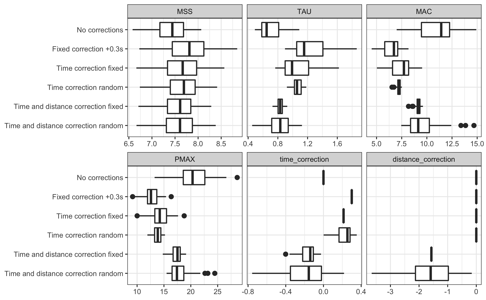

```r
model_resid <- rbind(
  data.frame(
    model = "No corrections",
    no_corrections$data
  ),
  data.frame(
    model = "Fixed correction +0.3s",
    fixed_correction$data
  ),
  data.frame(
    model = "Time correction fixed",
    time_correction_fixed$data
  ),
  data.frame(
    model = "Time correction random",
    time_correction_random$data
  ),
  data.frame(
    model = "Time and distance correction fixed",
    time_distance_correction_fixed$data
  ),
  data.frame(
    model = "Time and distance correction random",
    time_distance_correction_random$data
  )
)


model_resid$model <- factor(
  model_resid$model,
  levels = rev(c(
    "No corrections",
    "Fixed correction +0.3s",
    "Time correction fixed",
    "Time correction random",
    "Time and distance correction fixed",
    "Time and distance correction random"
  ))
)

model_resid$resid <- model_resid$pred_time - model_resid$time

# Create SWC / SESOI band
model_SESOI <- model_resid %>%
  group_by(model, distance) %>%
  summarise(
    bias = mean(resid),
    variance = sd(resid),
    upper = bias + variance,
    lower = bias - variance,
    MAD = mean(abs(resid)),
    SESOI_upper = sd(time) * 0.2,
    SESOI_lower = -sd(time) * 0.2
  )

# Plot
ggplot(model_resid, aes(y = model)) +
  theme_bw(8) +
  geom_vline(
    data = model_SESOI,
    aes(xintercept = SESOI_lower),
    color = "blue", alpha = 0.5, linetype = "dashed"
  ) +
  geom_vline(
    data = model_SESOI,
    aes(xintercept = SESOI_upper),
    color = "blue", alpha = 0.5, linetype = "dashed"
  ) +
  geom_vline(xintercept = 0, color = "blue", alpha = 0.5) +
  geom_jitter(aes(x = resid), alpha = 0.1, height = 0.25) +
  geom_errorbarh(
    data = model_SESOI,
    aes(xmin = lower, xmax = upper),
    height = 0.1, color = "black"
  ) +
  geom_point(data = model_SESOI, aes(x = bias), color = "black") +
  facet_wrap(~distance, scales = "free_x") +
  xlab("Predicted time - observed time (s)") +
  ylab(NULL)

```

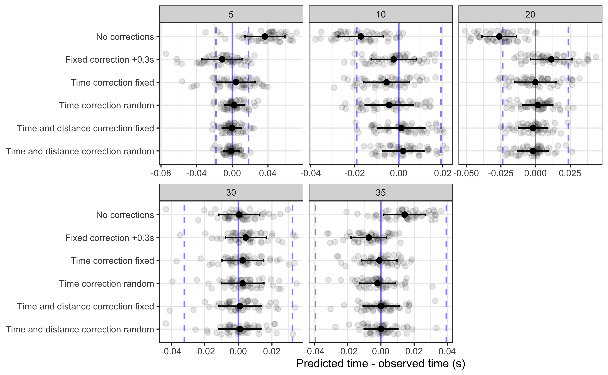

```r
df <- model_SESOI %>%
  pivot_longer(cols = -(1:2), names_to = "estimator") %>%
  filter(estimator %in% c("bias", "variance", "MAD"))

df$model <- factor(
  df$model,
  levels = rev(c(
    "No corrections",
    "Fixed correction +0.3s",
    "Time correction fixed",
    "Time correction random",
    "Time and distance correction fixed",
    "Time and distance correction random"
  ))
)

df$estimator <- factor(
  df$estimator,
  levels = c("bias", "variance", "MAD")
)

ggplot(df, aes(x = value, y = model)) +
  theme_bw(8) +
  geom_point() +
  facet_grid(distance ~ estimator, scales = "free_x") +
  xlab(NULL) +
  ylab(NULL)

```

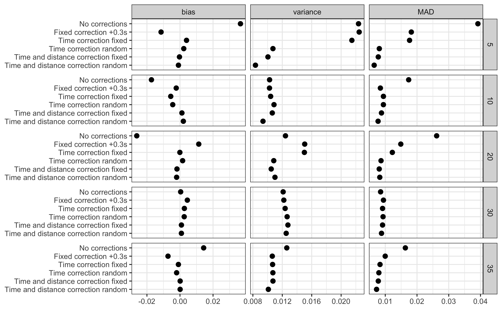


